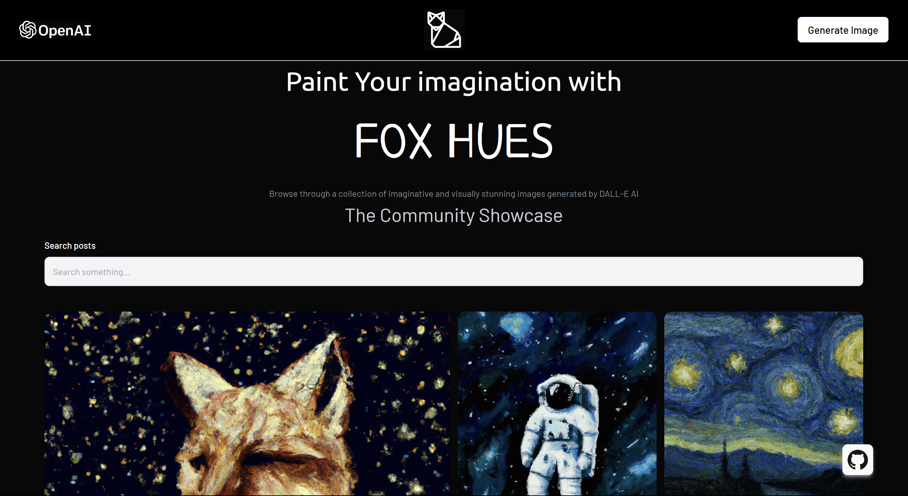

# AI Image Generator with OpenAI API (MERN Stack)



## Overview

This MERN stack project leverages the capabilities of the OpenAI API to create an AI image generator. With MongoDB for database management, Express.js for backend development, React for the frontend, and Node.js for server-side scripting, this application provides an intuitive way to generate AI-enhanced images.

## Features

- **Image Generation:** Utilize the power of the OpenAI API to generate unique and creative images.
- **MERN Stack:** Benefit from the MongoDB, Express.js, React, and Node.js stack for a robust and scalable application.
- **User Authentication:** Secure user data with authentication features, ensuring a personalized experience.
- **Responsive Design:** Create a seamless user experience with a responsive and visually appealing design.

## Prerequisites

Before getting started, make sure you have the following installed:

- Node.js: [Download and install Node.js](https://nodejs.org/)
- npm: npm is the package manager for Node.js and comes bundled with the installation of Node.js.
- MongoDB: [Install MongoDB](https://docs.mongodb.com/manual/installation/)

## Getting Started

1. Clone the repository:

    ```bash
    git clone https://github.com/minhajhameed/mern-ai-image-generator.git
    cd mern-ai-image-generator
    ```

2. Install dependencies:

    ```bash
    npm install
    ```

3. Set up MongoDB:
   
   - Create a MongoDB database.
   - Copy the `.env.example` file to a new file named `.env` and fill in your MongoDB connection URI:

    ```
    MONGODB_URI=your_mongodb_connection_uri
    ```

4. Obtain an API key for the OpenAI API.

5. Copy the `.env.example` file to a new file named `.env` and fill in your OpenAI API key:

    ```
    OPENAI_API_KEY=your_openai_api_key
    ```

6. Start the development server:

    ```bash
    npm run dev
    ```

7. Open your browser and visit [http://localhost:3000](http://localhost:3000) to see the application in action.

## Usage

1. Go to image generation page.
2. Enter your instruction or use "random" button.
3. Click the "Generate Image" button.
4. The application will communicate with the OpenAI API and display the AI-generated image.
5. share Your image with community.

## Contributing

Contributions are welcome! If you have ideas for improvements or find any issues, please submit a pull request or open an issue.

## Contact

For any questions or feedback, feel free to reach out to us at [minhajham@yahoo.com](mailto:minhajham@yahoo.com).